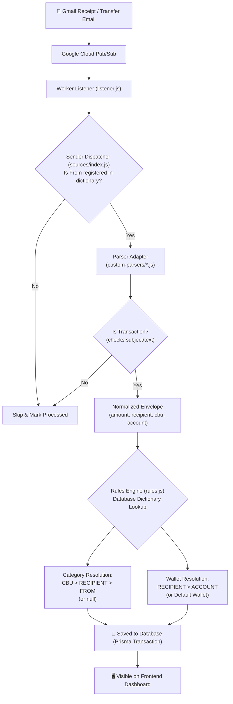

# Monkey Man (Finance Tracker)

A personal finance tracker with Neumorphic design built as a full-stack Next.js monorepo with an autonomous background email receipt & transfer ingestion worker.

## Architecture

- **Frontend:** Next.js (Port `7071`)
- **Backend:** Next.js API Routes (Port `7070`)
- **Background Worker:** Node.js Gmail Pub/Sub listener & parser engine
- **Database:** Prisma with SQLite (`dev.db`)
- **Package Manager:** pnpm workspaces

---

## 🔄 How It Works (Ingestion Flow)

Monkey-Man automatically converts email receipts and bank transfer notifications into structured finance transactions:



1. **Email Notification:** When a bank or vendor sends you an email, Google Cloud Pub/Sub sends a push notification to `listener.js`.
2. **Sender Dispatch:** `sources/index.js` checks the `From` header against its registered sender dictionary (`sender -> parser`). If the sender is unmapped, the email is skipped immediately.
3. **Parsing & Filtering:** The assigned parser checks the email. If it is a newsletter, promotional alert, or account statement, the parser returns `null` and it is safely ignored. If it is an actual transaction, the parser extracts details into a standardized envelope (`amount`, `recipient`, `cbuDestino`, `cuentaOrigen`, `occurredAt`).
4. **Rules & Categorization (Dictionary Lookup):**
   - **Category (Optional):** Checks your database rules for `CBU` $\rightarrow$ `RECIPIENT` (merchant/name) $\rightarrow$ `FROM`. If found, assigns that Category; otherwise leaves it uncategorized (`null`).
   - **Wallet (Required):** Checks if a rule assigns a wallet (e.g. `recipient: Uber -> wallet: MercadoPago` or `account: 123-456 -> wallet: Checking`). If not matched, assigns your default wallet (`DEFAULT_WALLET_NAME`).
   - **Internal Transfers:** If a destination CBU is marked as yours (`isMine`), the transaction is automatically classified as a transfer between wallets.
5. **Persistence & Deduplication:** The transaction is saved to SQLite via Prisma, and `processed-message-ids.json` records the message ID so emails are never processed twice.

---

## 🛠️ Self-Hosting Guide

Follow these steps to deploy and run Monkey-Man on your own server or local machine.

### 1. Prerequisites
- [Docker](https://docs.docker.com/get-docker/) & Docker Compose
- A Google Cloud Platform (GCP) project with the **Gmail API** and **Cloud Pub/Sub API** enabled.

---

### 2. Secrets & Environment Setup

#### A. Centralized Secrets Folder (`./secrets/`)
Monkey-Man requires a Google Cloud Service Account to listen for real-time Gmail push notifications via Cloud Pub/Sub:

1. In the GCP Console, create a Service Account with the **Pub/Sub Subscriber** role.
2. Generate a JSON private key for this service account and download it.
3. In the root of this project, create a `secrets/` directory (if it does not exist) and save the key as:
   ```bash
   ./secrets/gcp-key.json
   ```
   > 🔒 **Security Note:** The `./secrets/` directory is strictly gitignored and excluded from Docker builds. It is mounted read-only (`:ro`) at runtime.

#### B. Environment Configuration (`.env`)
Copy the provided template to create your `.env` file at the root:

```bash
cp .env.example .env
```

Open `.env` and fill in the required variables:

| Variable | Description |
|---|---|
| `PORT` | Backend port (default `7070`). |
| `FRONTEND_PORT` | Frontend port (default `7071`). |
| `NEXT_PUBLIC_API_URL` | Public or local URL where the frontend talks to the backend (e.g. `http://localhost:7070`). |
| `GOOGLE_LABEL_ID` | The Gmail Label ID you want the worker to watch (e.g. `Label_12345...` or `INBOX`). |
| `GOOGLE_PROJECT_ID` | Your GCP project ID (e.g. `my-finance-project`). |
| `GOOGLE_TOPIC_NAME` | Full Cloud Pub/Sub topic name: `projects/<PROJECT_ID>/topics/<TOPIC_NAME>`. |
| `GOOGLE_PUBSUB_SUBSCRIPTION` | Pub/Sub subscription name (e.g. `monkey-sub`). |
| `GOOGLE_APPLICATION_CREDENTIALS` | Path inside container: `/app/secrets/gcp-key.json`. |
| `GOOGLE_CLIENT_ID` | Google OAuth 2.0 Client ID (Web/Desktop Application). |
| `GOOGLE_CLIENT_SECRET` | Google OAuth 2.0 Client Secret. |
| `GOOGLE_REFRESH_TOKEN` | OAuth Refresh Token with `https://www.googleapis.com/auth/gmail.readonly` scope. |
| `DEFAULT_WALLET_NAME` | (Optional) Fallback wallet name for unclassified transactions (defaults to `Checking Account`). |

---

### 3. Starting the Services

Start the development stack with Docker Compose:

```bash
docker compose up -d
```

This launches three containers:
- `frontend` on `http://localhost:7071`
- `backend` on `http://localhost:7070`
- `listener` running the background ingestion worker with hot reload

To stop the services:
```bash
docker compose down
```

---

### 4. Database

The database is **automatically initialized** on first boot — `docker compose up` creates the SQLite schema and seeds default Wallets (Checking, Savings, Cash, Digital Wallet) and Categories.

> **Note:** The listener container waits for the backend health check to pass before starting, ensuring the database is ready before email processing begins.

#### Re-seeding or Resetting
To re-run the seed script manually (e.g. after adding new default categories):
```bash
docker compose exec backend pnpm --filter backend db:seed
```

#### Accessing Database via Prisma Studio (development only)
To inspect or manage raw data:
```bash
docker compose exec backend pnpm --filter backend exec prisma studio -n 0.0.0.0
```
Open `http://localhost:5555` in your browser.

---

### 5. Adding Custom Bank & Receipt Parsers

Monkey-Man is designed to be completely provider-agnostic. All email parsers are pluggable custom modules placed in `./custom-parsers/`:

1. Drop your custom parser `.js` file directly into the root [`./custom-parsers/`](./custom-parsers/) directory on your host machine.
2. The folder is automatically mounted into the worker container and loaded on startup without modifying core code or rebuilding images.
3. Read the guide and example in [`./custom-parsers/README.md`](./custom-parsers/README.md) and [`apps/backend/worker/sources/custom/custom-source.example.js`](./apps/backend/worker/sources/custom/custom-source.example.js).

---

### 6. Production Deployment

To run optimized production builds:

```bash
docker compose -f docker-compose.prod.yml up -d --build
```


---

### 7. Security Hardening

Monkey-Man is a **single-user, self-hosted** tool with no built-in user authentication. Follow these steps to protect your financial data:

#### A. API Secret (Required for network exposure)
When your instance is accessible beyond `localhost`, you **must** set the API secret in `.env`:

```bash
# Generate a strong secret
openssl rand -hex 32

# Set both values to the same string in .env
API_SECRET=<your-generated-secret>
NEXT_PUBLIC_API_SECRET=<your-generated-secret>
```

Without this, anyone who can reach port `7070` has full read/write access to your transactions, wallets, and budgets.

#### B. CORS Origin (Recommended)
Restrict which origins can call your backend by setting `CORS_ORIGIN` in `.env`:

```bash
CORS_ORIGIN=http://localhost:7071   # or your actual frontend domain
```

Without this, any website you visit could potentially make requests to your backend if it is network-reachable.

#### C. Reverse Proxy
For internet-facing deployments, place both services behind a reverse proxy (Nginx, Caddy, Traefik) with HTTPS. Never expose ports `7070`/`7071` directly to the internet.

#### D. Prisma Studio
The development Docker Compose maps port `5555` for Prisma Studio (raw database access). This port is **not mapped** in `docker-compose.prod.yml`. Never expose it in production.
